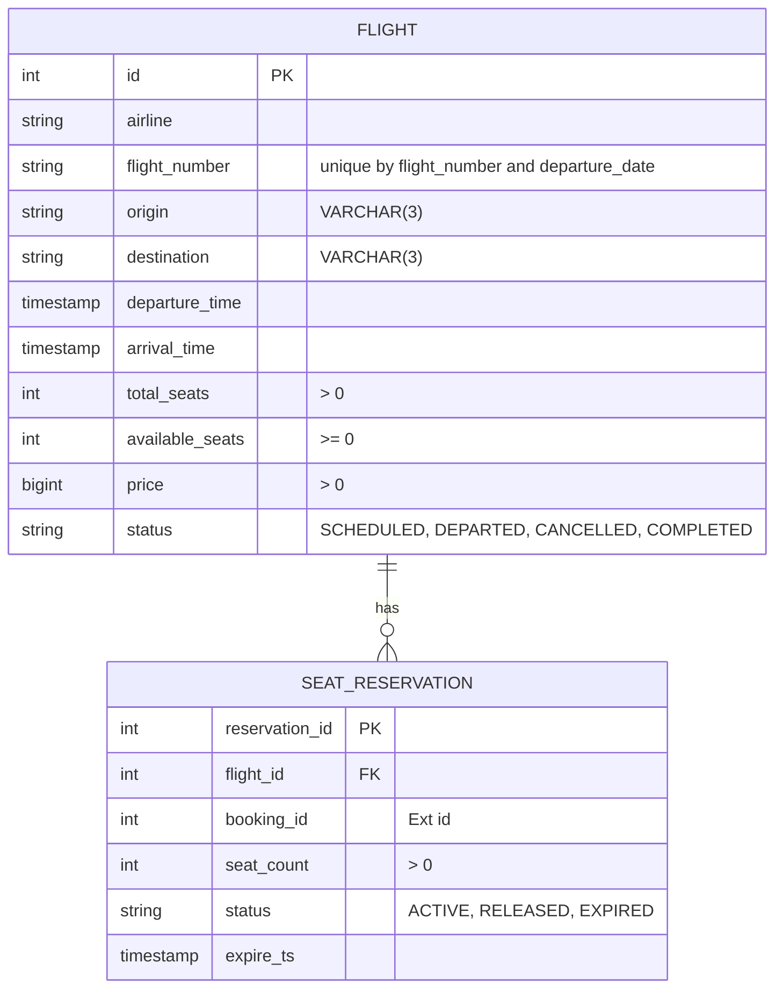

```mermaid
erDiagram

    FLIGHT ||--o{ SEAT_RESERVATION : "has"

    FLIGHT {
        int id PK
        string airline
        string flight_number "unique by flight_number and departure_date"

        string origin "VARCHAR(3)"
        string destination "VARCHAR(3)"

        timestamp departure_time
        timestamp arrival_time

        int total_seats "> 0"
        int available_seats ">= 0"

        bigint price "> 0"

        string status "SCHEDULED, DEPARTED, CANCELLED, COMPLETED"
    }

    SEAT_RESERVATION {
        int reservation_id PK
        int flight_id FK
        int booking_id "Ext id"

        int seat_count "> 0"
        string status "ACTIVE, RELEASED, EXPIRED"
        timestamp expire_ts
    }
```
