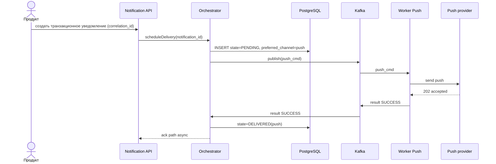
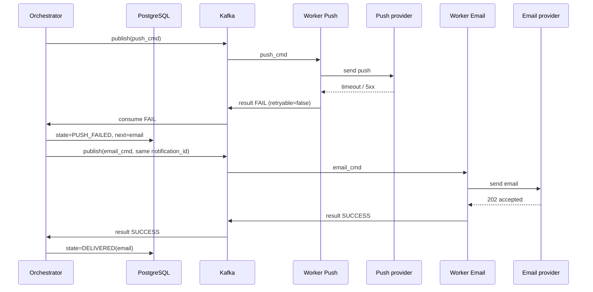
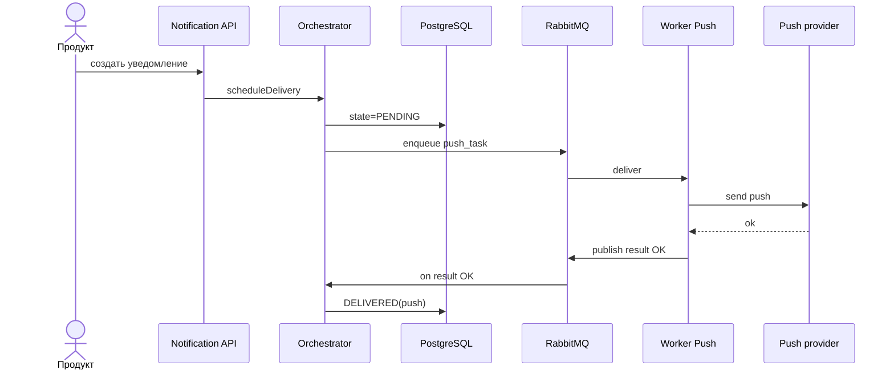
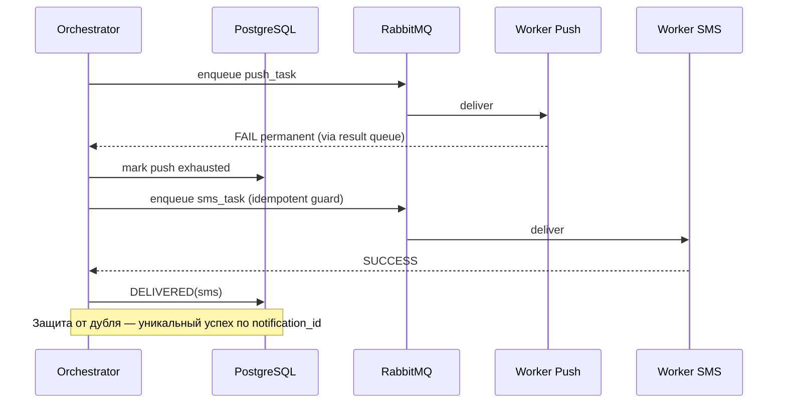

# RFC: Гарантированная доставка транзакционных уведомлений

| Метаданные | Значение |
|------------|----------|
| **Статус** | DRAFT |
| **Автор(ы)** | Коновалов Артем |
| **Ответственный** | Коновалов Артем |
| **Бизнес-заказчик** | Джон Доу |
| **Ревьюеры** | Коновалов Артем, 07.04.2026 |
| **Дата создания** | 06.04.2026 |
| **Дата обновления** | 07.04.2026 |

---

## Оглавление

1. [Контекст](#контекст)
2. [Продуктовый анализ](#продуктовый-анализ)
3. [Пользовательские сценарии](#пользовательские-сценарии)
4. [Статистика](#статистика)
5. [Требования](#требования)
6. [Варианты решения](#варианты-решения)
7. [Сравнительный анализ](#сравнительный-анализ)
8. [Выводы](#выводы)
9. [Связанные задачи](#связанные-задачи)
10. [Приложения](#приложения)

---

## Контекст

Онлайн-банк отправляет пользователям транзакционные уведомления. Они критичны для доверия и безопасности. Доставка идет через push, SMS, email. Также внешние провайдеры нестабильны

Сейчас без единого механизма гарантированной доставки и автоматического failover между каналами пользователь может не получить критичное сообщение либо получает дубль - из-за этого появляются жалобы

### Ключевые вопросы

- Какую проблему мы решаем?
Обеспечить доставку критичного уведомления хотя бы через один разрешённый канал, без дублей при failover, с учётом настроек пользователя (часть уведомлений можно отключить, но критичные транзакционные — нет)

- Почему это важно сейчас?
Рост доли мобильных сценариев и требований к SLA. Единая платформа уведомлений как цель
- Кто затронут этим изменением?
Клиенты банка, продуктовые команды, команда платформы уведомлений, комплаенс

### Границы

В scope: только транзакционные уведомления, определенные банком как которые нельзя отключить. Настройки влияют на предпочтительный канал и запрет дорогих каналов, если пользователь явно от них отказался

Вне scope: маркетинговые рассылки, полный дизайн всего сервиса. Комплаенс по каждому типу сообщения

---

## Продуктовый анализ

### Цели подсистемы

- At-least-one успешная доставка в разрешенный набор каналов для критичного уведомления
- Failover по приоритету каналов с учетом стоимости
- Идемпотентность - нет двух SMS о том же переводе из-за retry/failover.
- Наблюдаемость - метрики по каналам, статусам, причинам отказа.

### Не цели

- Гарантия того, что пользователю прочитал уведомление
- Выбор произвольного порядка каналов без политики стоимости

### Риски продукта

- Восприятие дубля при failover как спама


## Пользовательские сценарии

| Приоритет | Тип сценария | Действующее лицо | Сценарий |
|-----------|--------------|------------------|----------|
| MUST HAVE | Успешная доставка | Клиент банка | После успешного перевода клиент получает подтверждение в основном канале |
| MUST HAVE | Failover | Клиент банка | Если push/провайдер недоступен в пределах таймаута, система автоматически пытается отправить в следующий разрешенный канал, без второго успешного push |
| MUST HAVE | Настройки | Клиент банка | Пользователь может задать предпочтительный канал для транзакционных. Также может отключить некоторые каналы. Нельзя полностью отключить критичные транзакционные уведомления |
| MUST HAVE | Стоимость | Банк | Система минимизирует дорогие SMS: SMS не используется, пока не исчерпаны дешевые каналы |
| SHOULD HAVE | Наблюдаемость | Операции | По инциденту можно по id операции проследить цепочку попыток и почему выбрали канал |

**Приоритеты:**
- **MUST HAVE** — обязательно к реализации
- **SHOULD HAVE** — желательно реализовать
- **COULD HAVE** — опционально, при наличии ресурсов

---

## Статистика

- MAU 10 млн, DAU 3 млн, пик одновременных пользователей 300 тысяч
- Среднее число транзакционных уведомлений на пользователя в день: 2.

**Оценка порядка величин только для транзакционной нагрузки:**

- Событий в сутки (оценка по DAU): \(3 \cdot 10^6 \times 2 = 6 \cdot 10^6\) в сутки
- Средний RPS: \(6 \cdot 10^6 / 86400 \approx 70\) событий в секунду
- Пик порядка 1 - 1,5 тыс. событий в секунду на приём в платформу
- Общий потолок платформы 10 000 событий в секунду в пик — транзакционная подсистема занимает меньшую долю полосы, остальное — сервисные и маркетинговые потоки

---

## Требования

### Функциональные требования

| № | Приоритет | Обозначение | Требование |
|---|-----------|-------------|------------|
| 1 | MUST HAVE | FR-D1 | Для критичного транзакционного уведомления система достигает успеха доставки хотя бы в одном разрешенном канале |
| 2 | MUST HAVE | FR-D2 | При отказе/таймауте очередного канала система автоматически инициирует доставку в следующий канал по политике приоритета и настроек |
| 3 | MUST HAVE | FR-D3 | Транзакционные критичные уведомления нельзя отключить полностью |
| 4 | MUST HAVE | FR-D4 | Учитывается предпочтительный канал пользователя в рамках политики стоимости и доступности |
| 5 | MUST HAVE | FR-D5 | Предотвращение дублей при failover - не более одного пользовательского значимого исхода на айдишнике |
| 6 | MUST HAVE | FR-D6 | Наблюдаемость - каждая попытка доставки логируется со связкой айдишник, канал, провайдер, код возврата |
| 7 | SHOULD HAVE | FR-D7 | Политика каналов по умолчанию: push $\rightarrow$ email $\rightarrow$ SMS для снижения стоимости уведомления |

### Нефункциональные требования

| № | Приоритет | Обозначение | Требование |
|---|-----------|-------------|------------|
| 1 | MUST HAVE | NFR-D1 | p95 времени приема запроса на доставку в подсистему и фиксации состояния <= 200 мс |
| 2 | MUST HAVE | NFR-D2 | Доступность компонента приема или оркестрации не ниже целевой 99,9% в месяц для API платформы |
| 3 | MUST HAVE | NFR-D3 | Горизонтальное масштабирование воркеров каналов и разделение очередей по каналам для пиков |
| 4 | MUST HAVE | NFR-D4 | Шифрование TLS для внешних вызовов |
| 5 | SHOULD HAVE | NFR-D5 | Метрики: доля SMS, p95 времени до успеха приема уведомления |

**Расчёт нагрузок:** см. раздел [Статистика](#статистика). Целевой пик приёма транзакционных уведомлений 1k событий в секунду (порядок величин), согласованный с потолком 10 000 событий в секунду всей платформы.

### ASR подсистемы доставки (с приоритетами)

| Приоритет | Обозначение | Формулировка | Связь с ASR платформы (`solution.md`) |
|-----------|-------------|--------------|----------------------------------------|
| 0 | ASR-D1 | Низкая задержка: приём и фиксация намерения доставки без синхронных вызовов провайдеров | ASR 1 |
| 0 | ASR-D2 | Устойчивость к отказам каналов или провайдеров: retry, таймауты, failover, идемпотентность | ASR 3 |
| 1 | ASR-D3 | Масштабирование воркеров и изоляция каналов | ASR 2 |

---

## Варианты решения

### Вариант 1: Оркестратор доставки + PostgreSQL + Kafka

> **Описание:** Отдельный оркестратор доставки ведет конечный автомат в PostgreSQL. Kafka развозит задачи воркерам по каналам. Статусы и защита от повторов - в БД. Сами воркеры без локального состояния, только забирают работу из топика.

#### Архитектура

- Notification API принимает запрос от продуктов, валидирует политику, выдает айдишник, ставит задачу оркестратору.
- Delivery Orchestrator обновляет состояние, публикует команды в топики Kafka `delivery.push`, `delivery.sms`, `delivery.email`.
- Channel Workers - 3 пула читают свои топики, вызывают адаптеры провайдеров, пишут результат обратно через API оркестратора или топик `delivery.results`.
- PostgreSQL — источник правды по состоянию, идемпотентный ключ состоящий из `(notification_id, channel, attempt_num)`
- Наблюдаемость: Prometheus

Технологии: Java + Spring Boot; PostgreSQL 16; Apache Kafka 3.1; Kubernetes; Prometheus

#### Диаграмма C4 - Container

```c4x
%%{ c4: container }%%
graph TB
    subgraph Bank {
        Prod[Продуктовые сервисы<br/>Software System]
        API[Notification API<br/>Container]
        ORCH[Оркестратор доставки<br/>Container]
        DB[PostgreSQL, состояние доставки<br/>Container]
        K[Kafka, топики по каналам<br/>Container]
        WP[Воркер Push<br/>Container]
        WS[Воркер SMS<br/>Container]
        WE[Воркер Email<br/>Container]
    }
    Client[Клиент<br/>Person]
    EXT[Провайдеры push, SMS, email<br/>Software System<br/>External]

    Client -.->|уведомление пользователю| EXT
    Prod ==>|HTTPS: критичное уведомление| API
    API ==>|внутренний вызов| ORCH
    ORCH ==>|чтение/запись состояния| DB
    ORCH ==>|команды в брокер| K
    K -.->|задачи| WP
    K -.->|задачи| WS
    K -.->|задачи| WE
    WP ==>|вызов API провайдера| EXT
    WS ==>|вызов API провайдера| EXT
    WE ==>|вызов API провайдера| EXT
    WP -.->|итог попытки| K
    WS -.->|итог попытки| K
    WE -.->|итог попытки| K
    K -.->|ответы в оркестратор| ORCH
```

#### Sequence - основной сценарий (успех на push)



#### Sequence - failover push -> email



#### Соответствие ASR подсистемы

| ASR | Как выполняется |
|-----|-----------------|
| ASR-D1 | Оркестратор только пишет состояние и ставит задачи |
| ASR-D2 | FSM, таймауты, следующий канал. Повторные попытки не должны плодить лишние успехи в PostgreSQL |
| ASR-D3 | Отдельные топики по каналам. Масштабирование воркеров независимо от API |

#### Масштаб и нагрузка (вариант 1)

- Kafka: несколько брокеров (кластер с 3+ узлами). партиции топиков по хэшу для упорядочивания по ключу уведомления
- Оркестратор: 3+ инстанса за балансировщиком, логика опирается на БД, не на память процесса
- Workers: горизонтальное масштабирование по метрикам. Отдельные лимиты на SMS-воркеры

#### Этапы реализации

| Этап | Описание | Планируемый срок | Ресурсы | Риски |
|------|----------|------------------|---------|-------|
| 1 | Схема БД FSM, API приема, публикация в Kafka | 3-4 недели | 2 backend, 1 SRE | Неверная модель состояний |
| 2 | Воркеры каналов, контракт результатов, метрики | 3-4 недели | 2 backend | Несовместимость интерфейсов провайдеров |
| 3 | Нагрузочное тестирование, тест 5% трафика | 2 недели | 1 QA, 1 SRE | Искажение SLO из-за провайдеров |

#### Преимущества

- Хорошая масштабируемость и привычная модель для высокого RPS
- Четкий аудит состояния в Postgres

#### Недостатки

- Выше операционная сложность - Kafka и схемы топиков.
- Нужна дисциплина схем сообщений и миграций.

---

### Вариант 2: Оркестратор + PostgreSQL + RabbitMQ

> **Описание:** Тот же оркестратор и FSM в Postgres, но вместо Kafka — RabbitMQ как брокер задач с очередями per-channel и dead-letter для отложенных ретраев. Подходит при более гладком пике и желании упростить эксплуатацию.

#### Архитектура

- Компоненты те же по смыслу: API, Orchestrator, PostgreSQL, три типа воркеров
- RabbitMQ: очереди `delivery.push`, `delivery.email`, `delivery.sms`. Результаты — queue `delivery.results`.

Технологии: Java + Spring Boot; PostgreSQL 16; RabbitMQ 3.13; Kubernetes; Prometheus

#### Диаграмма C4 - Container

```c4x
%%{ c4: container }%%
graph TB
    Prod[Продуктовые сервисы<br/>Software System]
    API[Notification API<br/>Container]
    ORCH[Delivery Orchestrator<br/>Container]
    DB[PostgreSQL<br/>Container]
    Q[RabbitMQ очереди каналов<br/>Container]
    WP[Worker Push<br/>Container]
    WS[Worker SMS<br/>Container]
    WE[Worker Email<br/>Container]
    EXT[Провайдеры<br/>Software System<br/>External]

    Prod --> API
    API --> ORCH
    ORCH --> DB
    ORCH ==>|publish| Q
    Q -.-> WP
    Q -.-> WS
    Q -.-> WE
    WP ==>|send| EXT
    WS ==>|send| EXT
    WE ==>|send| EXT
    WP -.->|results| Q
    WS -.->|results| Q
    WE -.->|results| Q
    Q -.->|results consumer| ORCH
```

#### Sequence - основной сценарий (успех на push)



#### Sequence - failover (push сдох, дальше SMS)



#### Соответствие ASR подсистемы

| ASR | Как выполняется |
|-----|-----------------|
| ASR-D1 | Аналогично варианту 1: провайдеры вне API |
| ASR-D2 | FSM + ручной переход канала оркестратором |
| ASR-D3 | Разные очереди и пулы воркеров. На совсем большом RPS брокер может попроситься на шардинг, иначе снова смотреть в сторону Kafka |

#### Масштаб и нагрузка (вариант 2)

- RabbitMQ: кластер из 3 узлов, зеркала или quorum-очереди, на SMS отдельные лимиты скорости.
- Пик 1k - 1.5k транзакционных событий/с на приеме реалистичен, если воркеров хватает. Относительно общего потолка 10k событий/с запас нормальный, но разогнать чтение горизонтально Rabbit обычно тяжелее, чем Kafka.

#### Этапы реализации

| Этап | Описание | Планируемый срок | Ресурсы | Риски |
|------|----------|------------------|---------|-------|
| 1 | Схема БД, интеграция RabbitMQ, базовые воркеры | 3 недели | 2 backend | Сложность retry |
| 2 | Политика failover, метрики, SLO | 2 недели | 1 backend, 1 SRE | Залипание в retry |
| 3 | Нагрузочные тесты, пилот | 2 недели | QA, SRE | Залипание в блокировках |

#### Преимущества

- Проще операционно для команд, уже знакомых с RabbitMQ.
- Хорошо подходит для очередей задач и классических retry.

#### Недостатки

- На очень высоком RPS и куче партиций Kafka обычно проще наращивать пропускную способность и заново прогонять лог
- Нужно внимательно проектировать очереди, чтобы избежать блокировок между каналами

---

## Сравнительный анализ

### Компромиссы

| Тема | Вариант 1 (Kafka) | Вариант 2 (RabbitMQ) |
|------|-------------------|----------------------|
| Пропускная способность и повтор после сбоя | Проще нарастить партициями и перечитать лог | На средних пиках ок, на экстремальных упремся раньше |
| Операционка | Тяжелее | Легче, если команда уже жила на Rabbit |
| Задержка до первой попытки | Зависит от того, как консьюмеры успевают вычитывать | Если очередь одна жирная, первые сообщения могут ждать дольше (head-of-line) |
| Деньги на инфраструктуру | Обычно дороже | Обычно дешевле на старте |

### Ресурсные требования

| Критерий | Вариант 1 | Вариант 2 |
|----------|-----------|-----------|
| Время реализации (MVP подсистемы) | примерно 8–10 недель | примерно 7–9 недель |
| Команда | 2–3 backend, 1 SRE, 0.5 QA | 2 backend, 1 SRE, 0.5 QA |
| Инфраструктура | Kafka кластер + PostgreSQL + K8s | RabbitMQ кластер + PostgreSQL + Kubernetes |
| Организационные риски | Обучение Kafka, контракты схем | Лимиты брокера на пике |

### Соответствие требованиям

| Требование | Вариант 1 | Вариант 2 |
|------------|-----------|-----------|
| FR-D1 | ✅ | ✅ |
| FR-D2 | ✅ | ✅ |
| FR-D3 | ✅ | ✅ |
| FR-D4 | ✅ | ✅ |
| FR-D5 | ✅ | ✅ |
| FR-D6 | ✅ | ✅ |
| FR-D7 | ✅ | ✅ |
| NFR-D1 | ✅ | ✅ |
| NFR-D2 | ✅ | ✅ |
| NFR-D3 | ✅ | ✅❌ может потребовать шардирования |
| NFR-D4 | ✅ | ✅ |
| NFR-D5 | ✅ | ✅ |

### Соответствие ASR подсистемы

| ASR | Вариант 1 | Вариант 2 |
|-----|-----------|-----------|
| ASR-D1 | ✅ | ✅ |
| ASR-D2 | ✅ | ✅ |
| ASR-D3 | ✅ | ✅❌ зависит от пиков и настройки очередей |

---

## Выводы

> **Рекомендация:** вариант 1 (оркестратор + PostgreSQL + Kafka) как основной под заявленные масштабы: есть куда расти по партициям и при аварии можно перечитать лог.

**Почему так:**

- Цифры из статистики и потолок 10 000 событий/с на всю платформу лучше ложатся на Kafka, чем на один узкий Rabbit
- Failover и защита от дублей в обоих вариантах все равно сидят в PostgreSQL; отличается в основном шина. Kafka проще масштабировать и к ней проще прикрутить нормальный мониторинг лага.

**Ограничения:**

**Ограничения решения:**

- Гарантия — от платформы до провайдера по контракту. Доставка на устройство офлайн-клиента не контролируется полностью
- SMS остается дорогим — нужны лимиты и продуктовые алерты по доле SMS в уведомлениях
- Матрица какие типы нельзя отключить должна быть зафиксирована вне RFC

---

## Связанные задачи

- Согласование политики каналов и согласий пользователя с комплаенсом.
- Контракты с провайдерами push/SMS/email (SLA, webhooks, статусы доставки SMS, ключи идемпотентности).

---

## Приложения

### Глоссарий

| Термин | Определение |
|--------|-------------|
| Failover | Переход на резервный канал после неуспеха основного по политике |
| FSM | Конечный автомат состояний доставки для одного уведомления (`notification_id`) |
| Идемпотентность | Повтор не должен дать второй "нормальный" успех тому же пользователю |
| correlation_id | Один id на цепочку от продукта до провайдера, чтобы в логах не потеряться |
